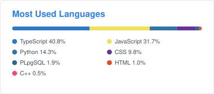

<h1 align="center">Hi, I'm Yash Jindal</h1>

  <b>Analyst, Operations Performance &amp; Analytics @ United Airlines</b> · Data Science · Machine Learning · Building data products 
  Working toward a Master's in Data Science with a focus on AI/ML

  
  
  

---

### About me

- I build analytics, forecasting and decision-support tools at **United Airlines**. My work there has helped unlock **$77M+** in operational impact.
- I build predictive models (regression, time series), ETL pipelines in **Python / SQL / PySpark**, and LLM-powered self-service analytics.
- **Awards:** Sky Laureates Award (2026), IKC Ambassador Award (2026), 1K Category Award (2025) at United Airlines.
- **Education:** B.Tech, Electrical Engineering, Punjab Engineering College (CGPA 8.2).
- **Next:** a Master's in **Data Science**, going deeper into machine learning, deep learning and applied AI.

### Tech stack

**Data science & ML** 

**Analytics & BI** 

**Building products** 

### Projects

| Project | What it does |
| --- | --- |
| [**GoBizSchool**](https://gobizschool.com) | A business-school discovery and application platform. It tracks deadlines, rounds and school profiles for top MBA programs and helps you plan each application through to submission. |
| [**Resume Studio**](https://resumestudio.gobizschool.com) | Write a LaTeX resume in the browser with a live preview and a print-ready PDF. No sign-up, no server. |
| [**Referrals**](https://referrals.jindalyash.com) | A structured way to request a United Airlines referral from me, so every request arrives with the details I need. |
| [**Tools by Yash**](https://tools.jindalyash.com) | Private developer utilities that run entirely in the browser: JSON, cron, tokens, encoding, colors and more. |
| [**The Curious Jindal**](https://writing.jindalyash.com) | My writing on technology, aviation, work and ideas. |
| [**Portfolio**](https://jindalyash.com) | My personal site: experience, skills, projects and awards. |
| [**Links**](https://links.jindalyash.com) | One map of everything I'm building. |

**Open source:** [**PyInsider**](https://github.com/Yashjindal11/pyinsider) records a Python program's real execution (calls, timings, arguments, exception paths) so you can explore it in a viewer. [**project-mapper**](https://github.com/Yashjindal11/projectmap) maps what a Python entry point depends on without running it.

### GitHub stats

  
  

